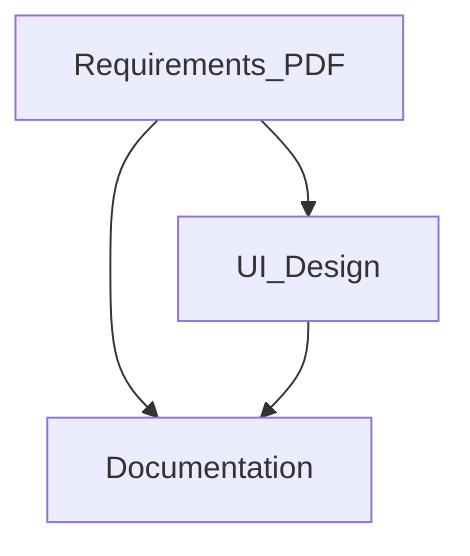

## Stack
Not a code project as it currently exists on disk — the repo root holds only planning/design artifacts (README.md, architecture.md, a Pencil `.pen` design file, and a requirements PDF). No source directories, no manifest file (no package.json/go.mod/pyproject.toml/Cargo.toml), and no entry-point files (main.*/index.*/app.*) are present. README.md documents a **planned** stack (C# .NET 8, ASP.NET Core MVC, EF Core, SQL Server) but none of that code exists in this repo yet.

## Directory map
| path | what lives there |
|---|---|
| `README.md` | Project overview, planned tech stack, planned folder structure, setup instructions |
| `architecture.md` | Pre-existing long-form architecture write-up (layers, RBAC, SOLID, ADRs) |
| `pension Management.pen` | Pencil UI/design file (binary, encrypted — not readable as text) |
| `pension Management System.pdf` | Requirements/reference PDF |
| `.git/` | Git metadata |

## Diagram

## Component index
- [[Requirements_PDF]]
- [[UI_Design]]
- [[Documentation]]

## Entry points
- Dev entry point: none present — TODO: verify (README.md describes a future `dotnet run` / `Program.cs`, not present on disk)
- Prod entry point: none present — TODO: verify

## Conventions
- Root-level filenames use spaces and mixed case (`pension Management.pen`, `pension Management System.pdf`) rather than kebab/snake case — observed directly in the file listing.
- Documentation files (`README.md`, `architecture.md`) use `##`-numbered sections with a Table of Contents and ASCII/box-drawing diagrams — observed in both files.
- Filesystem here is case-insensitive (APFS on `/Volumes/SIAM`), so `ARCHITECTURE.md` and `architecture.md` are the same file — observed when creating this file.

## Where things go
- To update the UI/screen designs, edit `pension Management.pen` (requires Pencil MCP tooling — do not open as plain text).
- To revise product/requirements source material, replace or annotate `pension Management System.pdf`.
- To change the documented (not-yet-built) system design, edit `architecture.md` content or this file.
- To actually start implementing the planned ASP.NET Core app, a new source tree (Domain/Application/Infrastructure/Presentation per README's planned structure) would need to be created — none exists yet.
